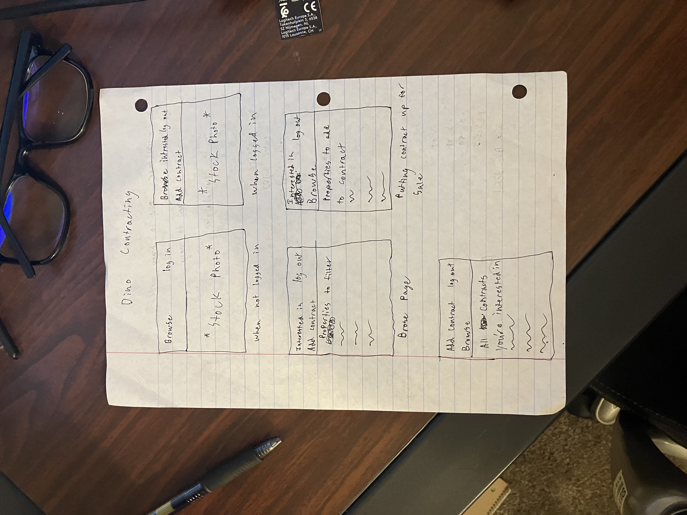

☐ App Title: Contains a description of what the app does and optional background info.
# Dino Contracting
-Users sign in and can post housing contracts that they want to sell

-Users can also sign in, and browse though contracts and make a list of contracts their interested in

-When browsing can filter for propertys that they are interested in

- ERD: https://lucid.app/lucidchart/195e0f90-308f-4b0b-874c-733317d91780/edit?viewport_loc=-59%2C248%2C1280%2C616%2C0_0&invitationId=inv_97199d04-6f93-4f23-bae8-2be2b7e4b5c4

☐ Screenshot(s): A screenshot of your app's landing page and any other screenshots of interest.

☐ Technologies Used: List of the technologies used.
-Oauth, Visual Studios, Express, MongoDB

☐ Getting Started: Include a link to the deployed app and your Trello board with the project's planning.

-Trello Link: https://trello.com/invite/b/QhttROVS/ATTIef36f12ca6d4d08bd36513c1913fb7c570371EE7/project-2

☐ Next Steps: Planned future enhancements (icebox items).